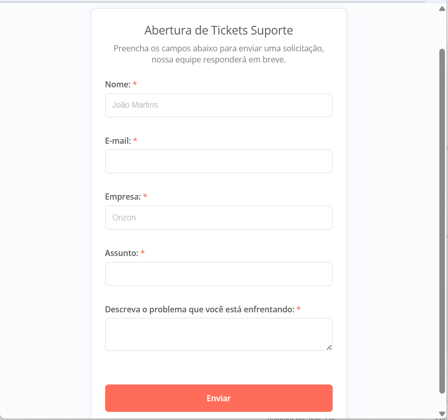
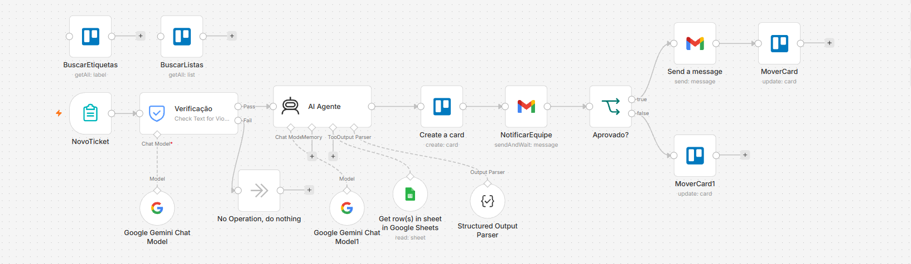
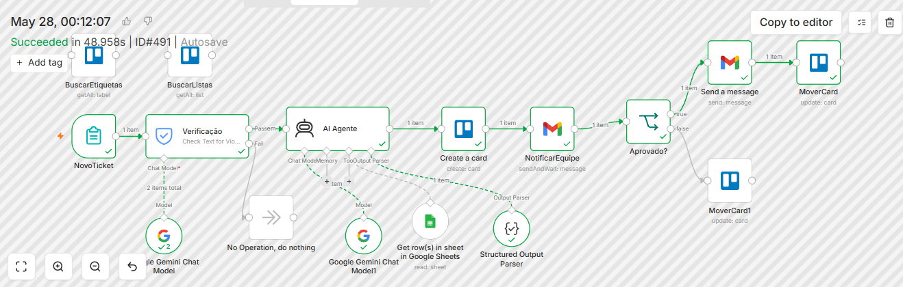
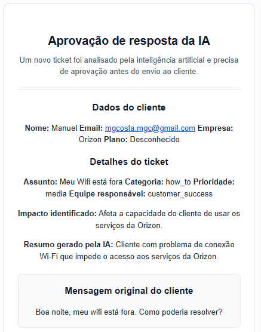
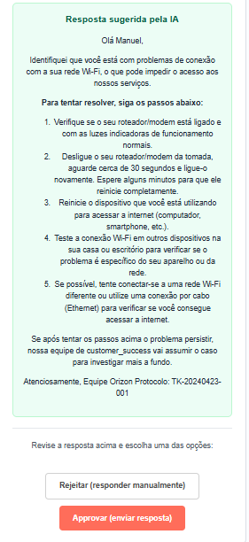

# AI Ticket Triage System with n8n

Sistema inteligente de triagem automatizada de tickets utilizando IA, n8n, Google Gemini, Gmail, Trello e Google Sheets.

---

## Visão Geral

Este projeto automatiza o processo completo de abertura, classificação, aprovação e resposta de tickets de suporte utilizando inteligência artificial.

O fluxo inclui:
- Validação de segurança com guardrails
- Classificação automática com IA
- Priorização inteligente
- Criação automática de cards no Trello
- Aprovação humana por e-mail
- Resposta automática ao cliente

---

## Formulário de abertura de tickets

---

## Workflow completo no n8n

---

## Execução do fluxo

---

## Aprovação humana via e-mail

---

## Resposta sugerida pela IA

---

## Gestão visual dos tickets no Trello

---

## Tecnologias Utilizadas

- n8n
- Google Gemini AI
- Gmail
- Google Sheets
- Trello
- Structured Output Parser
- Guardrails IA

---

## Fluxo da Automação

1. Cliente abre ticket via formulário
2. IA verifica se o ticket está dentro do escopo
3. Sistema classifica prioridade e categoria
4. Consulta dados do cliente
5. Cria card automaticamente no Trello
6. Envia aprovação para equipe
7. Caso aprovado:
   - Resposta enviada automaticamente
   - Card movido para "Resolvido pela IA"
8. Caso rejeitado:
   - Card movido para análise manual

---

## Funcionalidades

### Triagem Inteligente
- Classificação automática
- Priorização
- Direcionamento de equipe

### Segurança
- Guardrails contra solicitações indevidas
- Verificação de escopo

### Operação Automatizada
- Criação de tickets
- Pipeline visual
- Aprovação humana

### Comunicação
- E-mails HTML automáticos
- Respostas geradas por IA

---

## Melhorias Futuras

- Integração com WhatsApp
- SLA automático
- Dashboard analítico
- Banco vetorial
- Memória conversacional
- Multiagentes

---

## Autor

### Murilo Guimarães Costa

Especialista em Projetos, Automação e IA Aplicada.

- Open Finance
- Gestão de Projetos
- Inteligência Artificial
- n8n Automation

GitHub:
https://github.com/Murilo58
